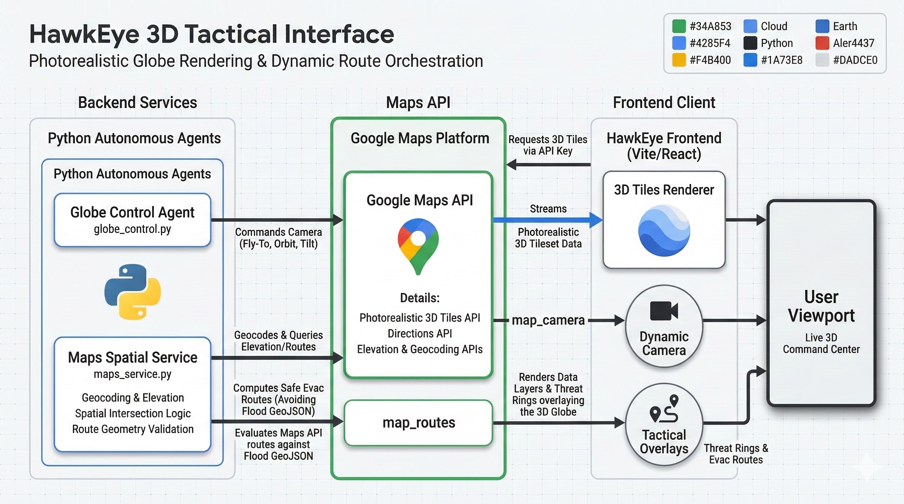
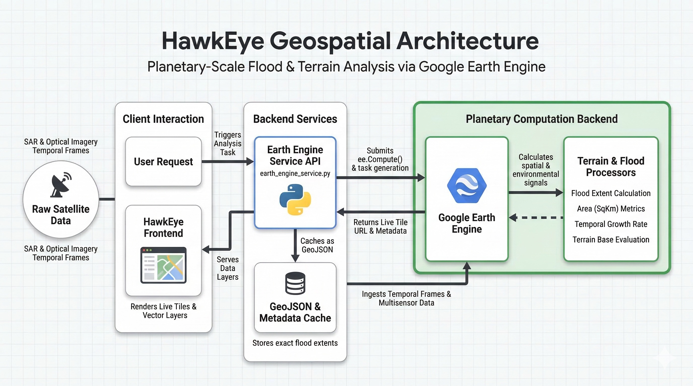
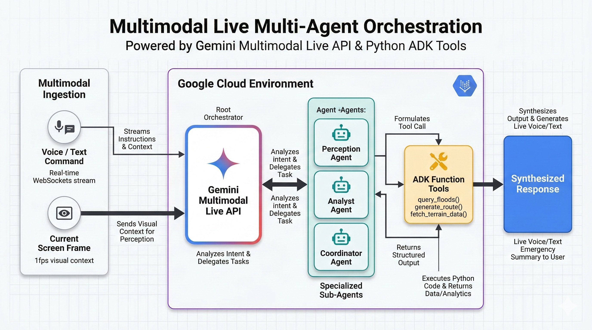
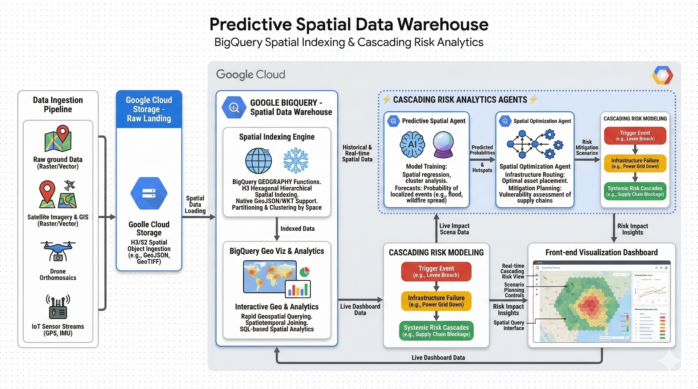

<div align="center">
  
# 🦅 HawkEye: AI Disaster Response Command Center

**A voice-controlled, predictive 3D command center powered entirely by the Google Cloud ecosystem, Google Earth Engine, and the Gemini Live API.**

[](https://cloud.google.com)
[](https://deepmind.google/technologies/gemini/)
[](https://earthengine.google.com/)
[](https://cloud.google.com/bigquery)

</div>

---

## 🌍 The Vision
When disasters like the catastrophic Jakarta floods strike, every minute costs lives. First responders operate blindly using 2D paper maps, radio chatter, and gut instinct. 

**HawkEye changes everything.**

Built as an elite, multi-agent AI command center, HawkEye leverages **17 distinct Google Services** to provide a living, breathing 3D geospatial intelligence platform. It doesn't just show where the water is—it predicts *what happens next*. By tapping into the massive **Groundsource dataset (2.6 million historical flood events)** via BigQuery, HawkEye calculates multi-order cascading failures (e.g., if water rises 2 meters, which substations fail, and how many hospitals lose power). 

All of this is controlled hands-free via **Gemini 2.5 Flash Native Audio**, allowing incident commanders to speak naturally with the system, receive proactive voice alerts, and even get "pushback" from the AI if an evacuation route is deemed unsafe.

---

## 🏆 For the Judges: Scope & Code Reproducibility

**Project Scope:**
HawkEye is a full-stack, bidi-streaming AI command center developed from scratch for the Gemini Live Agent Challenge. It features a React/CesiumJS frontend rendering Google Photorealistic 3D Tiles, backed by a FastAPI Python server that orchestrates 4 specialized ADK agents (Commander, Perception, Analyst, Predictor).

**What We Built:**
- Custom **WebSocket integration** with the Gemini Live API for real-time, low-latency native audio streaming.
- A **Multi-Agent orchestration system** built on the Google Agent Development Kit (ADK).
- A heavy-duty data pipeline processing the open-source **Groundsource dataset** directly through BigQuery.
- Dynamic 3D geospatial rendering using the **Google Maps Platform** and **Earth Engine** to calculate terrain and flood polygons on the fly.

**How to Reproduce the Codebase:**
To run this application locally and reproduce our deployment:
1. Clone this repository: `git clone https://github.com/tayyab415/hawkeye-gemini.git`
2. Navigate to the project root and create a `.env` file with your GCP credentials, Gemini API key, Earth Engine credentials, and Maps API key.
3. **Backend Setup:**
   ```bash
   cd hawkeye
   pip install -r pyproject.toml # or standard pip dependencies
   uvicorn app.main:app --host 0.0.0.0 --port 8080
   ```
4. **Frontend Setup:**
   ```bash
   cd hawkeye/frontend
   npm install
   npm run dev
   ```
5. **Data Ingestion (Optional but recommended):**
   Run the scripts in `hawkeye/data/` to load the Groundsource data into your BigQuery instance (`load_groundsource.sh`).

---

## 🏛️ GCP Architecture & Deep Integration

HawkEye is a masterclass in utilizing the Google Cloud Platform natively. Below are four highly detailed architectural diagrams illustrating exactly how we are pushing Google's infrastructure to its absolute limits.

### 1. Google Earth Engine: Terrain & Environmental Compute


**How it works in the codebase:**
Behind the scenes in `earth_engine_service.py`, when a live analysis task is submitted (`submit_live_analysis_task`), the backend connects to Google Earth Engine. GEE processes complex algorithms like temporal frame generation, flood water detection, and multisensor fusion. It takes raw spatial data (SAR/Optical satellite imagery), evaluates the terrain geometry, and returns actionable outputs: Live Tile URLs for visual rendering on the frontend, and GeoJSON shapes describing exact flood extents. GEE acts as our planetary-scale computation backend.

---

### 2. Google Earth & Maps: Photorealistic 3D Tiles & Motion


**How it works in the codebase:**
The frontend heavily utilizes the Google Maps API to stream Google Earth's photorealistic 3D Tiles. The agent, via `globe_control.py`, dispatches specific camera commands (`fly_to_location`, `set_camera_mode`) to manipulate the commander's viewport, controlling zooming, orbiting, and tilting for tactical views. Simultaneously, `maps_service.py` performs the heavy lifting for spatial context: fetching terrain elevation patches and calculating safe evacuation routes by dynamically avoiding flood geometries and drawing paths directly onto the 3D globe.

---

### 3. Gemini Live API: Multi-Agent Tool Calling & Orchestration


**How it works in the codebase:**
Gemini acts as the intelligent orchestration layer via the Google Agent Development Kit (ADK) in `agent.py`. The Gemini Live API ingests multimodal inputs—user voice commands, written instructions, and visual frames captured directly from the map viewport (`capture_current_view`). It analyzes this context to understand intent, delegates the logic to specific sub-agents (Analyst, Predictor, Coordinator), and autonomously triggers registered Python tools. For example, if asked about risks, Gemini triggers `get_infrastructure_vulnerability()`, waits for the BigQuery response, analyzes the data, and synthesizes a proactive, human-readable voice summary.

---

### 4. Google BigQuery: Ground Source Dataset & Predictions


**How it works in the codebase:**
BigQuery acts as our high-performance spatial data warehouse. We loaded the massive Groundsource datasets (population density, infrastructure networks, 2.6M historical flood events) into BigQuery. In `bigquery_service.py`, when an area floods, the system uses BigQuery's spatial indexing (`ST_INTERSECTS`) to rapidly determine which power lines, hospitals, or roads are affected. It aggregates temporal data to power frontend charts and analyzes patterns of failure to feed the Predictor Agent, which calculates multi-order cascading risks (e.g., downstream power loss) to visualize predictive "threat rings."

---

## 🚀 The 17 Google Services Powering HawkEye

We didn't just use Gemini; we built an ecosystem.
1. **Gemini Live API** — Native audio bidi-streaming for voice interaction.
2. **Gemini Standard API** — Text analysis and structured output processing.
3. **Nano Banana 2 (Gemini 3.1 Flash Image)** — Visual risk projection generation.
4. **Google ADK** — Multi-agent orchestration and Python tool delegation.
5. **Google BigQuery** — Groundsource dataset + spatial queries.
6. **Google Firestore** — Real-time session state and water level monitoring.
7. **Google Cloud Storage** — Drone footage and pre-computed GeoJSON assets.
8. **Google Maps Platform** — Core mapping integration.
9. **Google 3D Tiles API** — Photorealistic visualization in CesiumJS.
10. **Google Earth Engine** — Sentinel-1/2 flood extent analysis.
11. **Gmail API** — Emergency alert delivery.
12. **Places API** — Shelter location search.
13. **Directions API** — Evacuation route generation.
14. **Geocoding API** — Address to coordinate conversion.
15. **Vertex AI** — Model deployment and endpoint management.
16. **Cloud Run** — Automated, containerized backend deployment.
17. **Google Search Grounding** — Current event and meteorological verification.

---

## 🛠 Tech Stack Overview

- **Core AI/ML:** Google ADK, Gemini 2.5 Flash Native Audio, Gemini 3.1 Flash Image, Google GenAI SDK.
- **Backend:** Python 3.11+, FastAPI, WebSocket (bidi-streaming), Uvicorn.
- **Data & Storage:** BigQuery (geospatial SQL), Firestore, Cloud Storage, Earth Engine.
- **Frontend:** React 18, Vite, CesiumJS (3D globe), Google 3D Tiles API.
- **DevOps:** Google Cloud Build, Google Cloud Run, Docker.

---

*HawkEye exists to make sure no incident commander has to make life-or-death decisions in the dark ever again.*
